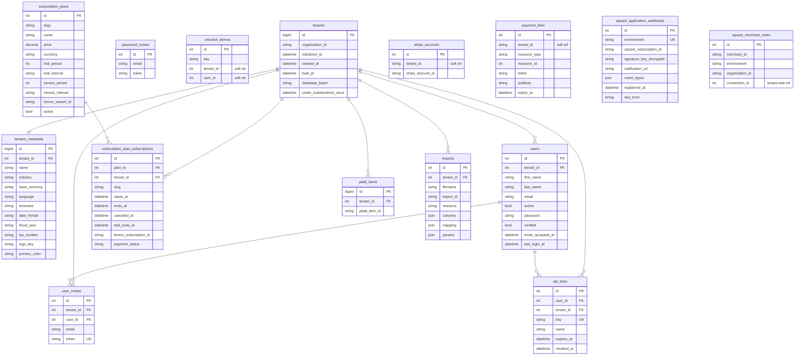

# BigCapital Database ERD

Domain-overview entity-relationship diagrams for the two BigCapital databases:

- **Tenant DB** — per-organization bookkeeping schema (accounts, GL, AR/AP, banking, inventory, …). One physical database per tenant.
- **System DB** — multi-tenant control plane (tenants, users, subscriptions, integrations).

Each entity shows its primary key, foreign keys, and a few domain-meaningful columns. Audit columns (`created_at`, `updated_at`, etc.) and pure-metadata tables are omitted. Polymorphic references (e.g. `reference_type` + `reference_id`) are noted in column lists but not drawn as lines.

Fork-specific tables and columns added on top of upstream `bigcapitalhq/bigcapital` are marked **(fork)**. See `.claude/CLAUDE.md` for the full list of fork divergences.

---

## Tenant DB

The tenant schema groups into these domains:

- **Ledger** — `accounts`, `accounts_transactions`, `manual_journals*`, `tax_rates`
- **Sales / AR** — `sales_invoices`, `sales_estimates`, `sales_receipts`, `payment_receives*`, `credit_notes*`
- **Purchases / AP** — `bills`, `bills_payments*`, `vendor_credits*`
- **Expenses** — `expenses_transactions`, `expense_transaction_categories`, `expense_payment_splits` (fork), landed costs
- **Items & Inventory** — `items*`, `inventory_*`, `warehouses*`
- **Banking & Cashflow** — `cashflow_*`, `uncategorized_cashflow_transactions`, `recognized_bank_transactions`, `bank_rules*`, `matched_bank_transactions` (fork)
- **Contacts & Currency** — `contacts`, `currencies`, `exchange_rates`
- **Projects** — `projects`, `tasks`, `times`
- **Settings / Views / Roles** — `users`, `roles`, `views*`, `settings`
- **Documents** — `documents`, `media*`, `pdf_templates`
- **Square integration** (fork) — `square_connections`, `square_event_log`, `square_*_mappings`, `square_document_links`
- **Payment integrations** — `payment_integrations`, `transactions_payment_methods`

```mermaid
erDiagram
    %% ============ Ledger ============
    accounts {
        int id PK
        int parent_account_id FK "self-ref"
        string currency_code FK
        string name
        string code
        string account_type
        decimal balance
        bool active
    }
    accounts_transactions {
        int id PK
        int account_id FK
        int contact_id FK "nullable"
        int item_id FK "nullable"
        int tax_rate_id FK "nullable"
        string reference_type "polymorphic"
        int reference_id "polymorphic"
        decimal debit
        decimal credit
        date date
    }
    manual_journals {
        int id PK
        string journal_number
        string journal_type
        decimal amount
        string currency_code
        date date
        datetime published_at
    }
    manual_journals_entries {
        int id PK
        int manual_journal_id FK
        int account_id FK
        int contact_id FK "nullable"
        decimal debit
        decimal credit
        string note
    }
    tax_rates {
        int id PK
        string name
        string code
        decimal rate
        bool is_compound
        bool active
    }

    %% ============ Sales / AR ============
    sales_invoices {
        int id PK
        int customer_id FK
        int pdf_template_id FK "nullable"
        date invoice_date
        date due_date
        string invoice_no
        decimal amount
        decimal balance
        decimal payment_amount
    }
    sales_estimates {
        int id PK
        int customer_id FK
        int pdf_template_id FK "nullable"
        decimal amount
        date estimate_date
        string estimate_number
        datetime delivered_at
        datetime approved_at
    }
    sales_receipts {
        int id PK
        int customer_id FK
        int deposit_account_id FK
        int pdf_template_id FK "nullable"
        decimal amount
        date receipt_date
        string receipt_number
        datetime closed_at
    }
    payment_receives {
        int id PK
        int customer_id FK
        int deposit_account_id FK
        int pdf_template_id FK "nullable"
        decimal amount
        date payment_date
        string payment_receive_no
    }
    payment_receives_entries {
        int id PK
        int payment_receive_id FK
        int invoice_id FK
        decimal payment_amount
    }
    credit_notes {
        int id PK
        int customer_id FK
        int pdf_template_id FK "nullable"
        decimal amount
        date credit_note_date
        decimal refunded_amount
        decimal invoices_amount
    }
    credit_note_applied_invoice {
        int id PK
        int credit_note_id FK
        int invoice_id FK
        decimal amount
    }
    refund_credit_note_transactions {
        int id PK
        int credit_note_id FK
        int from_account_id FK
        date date
        decimal amount
        string reference_no
    }

    %% ============ Purchases / AP ============
    bills {
        int id PK
        int vendor_id FK
        int pdf_template_id FK "nullable"
        date bill_date
        date due_date
        string bill_number
        decimal amount
        decimal payment_amount
        string status
    }
    bills_payments {
        int id PK
        int vendor_id FK
        int payment_account_id FK
        decimal amount
        date payment_date
        string payment_number
        string payment_method
    }
    bills_payments_entries {
        int id PK
        int bill_payment_id FK
        int bill_id FK
        decimal payment_amount
    }
    vendor_credits {
        int id PK
        int vendor_id FK
        decimal amount
        date vendor_credit_date
        decimal refunded_amount
        decimal invoiced_amount
    }
    vendor_credit_applied_bill {
        int id PK
        int vendor_credit_id FK
        int bill_id FK
        decimal amount
    }
    refund_vendor_credit_transactions {
        int id PK
        int vendor_credit_id FK
        int deposit_account_id FK
        date date
        decimal amount
    }

    %% ============ Expenses ============
    expenses_transactions {
        int id PK
        int payment_account_id FK "primary; denorm w/ splits"
        int payee_id FK "nullable"
        decimal total_amount
        date payment_date
        string reference_no
        datetime published_at
    }
    expense_transaction_categories {
        int id PK
        int expense_id FK
        int expense_account_id FK
        decimal amount
        string amount_type "fork: fixed|percent"
        decimal percent "fork"
        decimal landed_cost
    }
    expense_payment_splits {
        int id PK
        int expense_id FK
        int payment_account_id FK
        decimal amount
        int index
    }
    bill_located_costs {
        int id PK
        int bill_id FK
        int cost_account_id FK
        string from_transaction_type "polymorphic"
        int from_transaction_id "polymorphic"
        decimal amount
        string allocation_method
    }
    bill_located_cost_entries {
        int id PK
        int bill_located_cost_id FK
        int entry_id "polymorphic"
        decimal cost
    }

    %% ============ Items & Inventory ============
    items {
        int id PK
        int category_id FK
        int cost_account_id FK
        int sell_account_id FK
        int inventory_account_id FK "nullable"
        string name
        string type
        decimal sell_price
        decimal cost_price
        decimal quantity_on_hand
        bool active
    }
    items_categories {
        int id PK
        int cost_account_id FK
        int sell_account_id FK
        int inventory_account_id FK "nullable"
        string name
        string cost_method
    }
    items_entries {
        int id PK
        int item_id FK
        int sell_account_id FK "nullable"
        int cost_account_id FK "nullable"
        int tax_rate_id FK "nullable"
        string reference_type "polymorphic"
        int reference_id "polymorphic"
        decimal quantity
        decimal rate
        decimal discount
    }
    items_warehouses_quantity {
        int item_id PK
        int warehouse_id PK
        decimal quantity_on_hand
    }
    inventory_transactions {
        int id PK
        int item_id FK
        date date
        string direction
        decimal quantity
        decimal rate
        string transaction_type "polymorphic"
        int transaction_id "polymorphic"
    }
    inventory_cost_lot_tracker {
        int id PK
        int item_id FK
        date date
        decimal quantity
        decimal rate
        decimal remaining
        string transaction_type "polymorphic"
    }
    inventory_adjustments {
        int id PK
        int adjustment_account_id FK
        date date
        string type
        string reason
        datetime published_at
    }
    inventory_adjustments_entries {
        int id PK
        int adjustment_id FK
        int item_id FK
        decimal quantity
        decimal cost
        decimal value
    }
    warehouses {
        int id PK
        string name
        string code
        string city
        string country
        bool primary
    }
    warehouses_transfers {
        int id PK
        int from_warehouse_id FK
        int to_warehouse_id FK
        date date
        string transaction_number
        datetime transfer_initiated_at
        datetime transfer_delivered_at
    }
    warehouses_transfers_entries {
        int id PK
        int warehouse_transfer_id FK
        int item_id FK
        decimal quantity
        decimal cost
    }
    branches {
        int id PK
        string name
        string code
        bool primary
    }

    %% ============ Banking & Cashflow ============
    cashflow_transactions {
        int id PK
        date date
        decimal amount
        string transaction_type
        string transaction_number
        datetime published_at
    }
    cashflow_transaction_lines {
        int id PK
        int cashflow_account_id FK
        int credit_account_id FK
        decimal amount
        int index
    }
    uncategorized_cashflow_transactions {
        int id PK
        int account_id FK
        int recognized_transaction_id FK "nullable"
        date date
        decimal amount
        string payee
        string categorize_ref_type "polymorphic"
        int categorize_ref_id "polymorphic"
        bool categorized
        bool excluded
        bool pending
    }
    recognized_bank_transactions {
        int id PK
        int uncategorized_transaction_id FK
        int bank_rule_id FK
        int assigned_account_id FK
        string assigned_category
        string assigned_payee
    }
    bank_rules {
        int id PK
        int apply_if_account_id FK "nullable"
        int assign_account_id FK
        string name
        int order
        string apply_if_transaction_type
        string assign_category
        string conditions_type
    }
    bank_rule_conditions {
        int id PK
        int rule_id FK
        string field
        string comparator
        string value
    }
    matched_bank_transactions {
        int id PK
        int uncategorized_transaction_id FK
        string reference_type "polymorphic"
        int reference_id "polymorphic"
        int reference_sub_id "fork: split match"
        decimal amount
    }

    %% ============ Contacts & Currency ============
    contacts {
        int id PK
        string contact_type "customer|vendor"
        string contact_service
        string display_name
        string currency_code
        decimal balance
        decimal opening_balance
        bool active
    }
    currencies {
        int id PK
        string currency_name
        string currency_code
        string currency_sign
    }
    exchange_rates {
        int id PK
        string currency_code
        decimal exchange_rate
        date date
    }

    %% ============ Projects ============
    projects {
        int id PK
        int contact_id FK "nullable"
        string name
        date deadline
        decimal cost_estimate
        string status
    }
    tasks {
        int id PK
        int project_id FK
        string name
        string charge_type
        decimal rate
        decimal estimate_hours
        decimal actual_hours
    }
    times {
        int id PK
        int task_id FK
        int project_id FK
        decimal duration
        date date
    }

    %% ============ Settings / Views / Roles ============
    users {
        int id PK
        int role_id FK "nullable"
        int system_user_id "links to system DB users"
        string first_name
        string last_name
        string email
        bool active
        datetime invite_accepted_at
    }
    roles {
        int id PK
        string name
        string slug
        bool predefined
    }
    role_permissions {
        int id PK
        int role_id FK
        string subject
        string ability
        bool value
    }
    views {
        int id PK
        string name
        string slug
        string resource_model
        bool predefined
        bool favourite
    }
    view_has_columns {
        int id PK
        int view_id FK
        string field_key
        int index
    }
    view_roles {
        int id PK
        int view_id FK
        string field_key
        string comparator
        string value
    }
    settings {
        int id PK
        int user_id FK "nullable"
        string group
        string key
        string value
    }

    %% ============ Documents ============
    documents {
        int id PK
        string key
        string mime_type
        int size
        string origin_name
    }
    media {
        int id PK
        string attachment_file
    }
    media_links {
        int id PK
        int media_id FK
        string model_name "polymorphic"
        int model_id "polymorphic"
    }
    pdf_templates {
        int id PK
        string resource
        string template_name
        json attributes
        bool predefined
        bool default
    }

    %% ============ Square (fork) ============
    square_connections {
        int id PK
        int clearing_account_id FK "nullable"
        int fees_expense_account_id FK "nullable"
        int tips_liability_account_id FK "nullable"
        int deposit_bank_account_id FK "nullable"
        int walk_in_customer_id FK "nullable"
        string merchant_id
        string environment
        string status
        datetime connected_at
    }
    square_event_log {
        int id PK
        int connection_id FK
        string square_event_id
        string event_type
        string source
        json payload
        string status
        string created_reference_type "polymorphic"
        int created_reference_id "polymorphic"
        datetime received_at
        datetime processed_at
    }
    square_item_mappings {
        int id PK
        int connection_id FK
        int item_id FK "nullable"
        string square_catalog_object_id
        string square_object_type
        string square_name
        bool auto_created
    }
    square_customer_mappings {
        int id PK
        int connection_id FK
        int customer_id FK
        string square_customer_id
        bool auto_created
    }
    square_document_links {
        int id PK
        int connection_id FK
        int source_event_log_id FK "nullable"
        string square_object_type
        string square_object_id
        string bigcapital_document_type
        int bigcapital_document_id
    }

    %% ============ Payment integrations ============
    payment_integrations {
        int id PK
        string service
        string slug
        bool payment_enabled
        bool payout_enabled
        int account_id
        json options
    }
    transactions_payment_methods {
        int id PK
        int payment_integration_id FK
        string reference_type "polymorphic"
        int reference_id "polymorphic"
        bool enable
    }

    %% ============ Relationships ============
    %% Ledger
    accounts ||--o{ accounts : "parent_account_id"
    currencies ||--o{ accounts : ""
    accounts ||--o{ accounts_transactions : ""
    contacts ||--o{ accounts_transactions : ""
    items ||--o{ accounts_transactions : ""
    tax_rates ||--o{ accounts_transactions : ""
    manual_journals ||--o{ manual_journals_entries : ""
    accounts ||--o{ manual_journals_entries : ""
    contacts ||--o{ manual_journals_entries : ""

    %% AR
    contacts ||--o{ sales_invoices : "customer"
    contacts ||--o{ sales_estimates : "customer"
    contacts ||--o{ sales_receipts : "customer"
    contacts ||--o{ payment_receives : "customer"
    accounts ||--o{ sales_receipts : "deposit_account"
    accounts ||--o{ payment_receives : "deposit_account"
    pdf_templates ||--o{ sales_invoices : ""
    pdf_templates ||--o{ sales_estimates : ""
    pdf_templates ||--o{ sales_receipts : ""
    pdf_templates ||--o{ payment_receives : ""
    pdf_templates ||--o{ credit_notes : ""
    payment_receives ||--o{ payment_receives_entries : ""
    sales_invoices ||--o{ payment_receives_entries : ""
    contacts ||--o{ credit_notes : "customer"
    credit_notes ||--o{ credit_note_applied_invoice : ""
    sales_invoices ||--o{ credit_note_applied_invoice : ""
    credit_notes ||--o{ refund_credit_note_transactions : ""
    accounts ||--o{ refund_credit_note_transactions : "from_account"

    %% AP
    contacts ||--o{ bills : "vendor"
    pdf_templates ||--o{ bills : ""
    contacts ||--o{ bills_payments : "vendor"
    accounts ||--o{ bills_payments : "payment_account"
    bills_payments ||--o{ bills_payments_entries : ""
    bills ||--o{ bills_payments_entries : ""
    contacts ||--o{ vendor_credits : "vendor"
    vendor_credits ||--o{ vendor_credit_applied_bill : ""
    bills ||--o{ vendor_credit_applied_bill : ""
    vendor_credits ||--o{ refund_vendor_credit_transactions : ""
    accounts ||--o{ refund_vendor_credit_transactions : "deposit_account"

    %% Expenses
    accounts ||--o{ expenses_transactions : "primary payment_account"
    contacts ||--o{ expenses_transactions : "payee"
    expenses_transactions ||--o{ expense_transaction_categories : ""
    accounts ||--o{ expense_transaction_categories : "expense_account"
    expenses_transactions ||--o{ expense_payment_splits : ""
    accounts ||--o{ expense_payment_splits : "payment_account"
    bills ||--o{ bill_located_costs : ""
    accounts ||--o{ bill_located_costs : "cost_account"
    bill_located_costs ||--o{ bill_located_cost_entries : ""

    %% Items & Inventory
    items_categories ||--o{ items : ""
    accounts ||--o{ items : "cost / sell / inventory"
    accounts ||--o{ items_categories : "cost / sell / inventory"
    items ||--o{ items_entries : ""
    accounts ||--o{ items_entries : "sell / cost"
    tax_rates ||--o{ items_entries : ""
    items ||--o{ items_warehouses_quantity : ""
    warehouses ||--o{ items_warehouses_quantity : ""
    items ||--o{ inventory_transactions : ""
    items ||--o{ inventory_cost_lot_tracker : ""
    accounts ||--o{ inventory_adjustments : "adjustment_account"
    inventory_adjustments ||--o{ inventory_adjustments_entries : ""
    items ||--o{ inventory_adjustments_entries : ""
    warehouses ||--o{ warehouses_transfers : "from"
    warehouses ||--o{ warehouses_transfers : "to"
    warehouses_transfers ||--o{ warehouses_transfers_entries : ""
    items ||--o{ warehouses_transfers_entries : ""

    %% Banking & Cashflow
    accounts ||--o{ cashflow_transaction_lines : "cashflow_account"
    accounts ||--o{ cashflow_transaction_lines : "credit_account"
    accounts ||--o{ uncategorized_cashflow_transactions : ""
    recognized_bank_transactions ||--o| uncategorized_cashflow_transactions : "recognized link"
    uncategorized_cashflow_transactions ||--o{ recognized_bank_transactions : ""
    bank_rules ||--o{ recognized_bank_transactions : ""
    accounts ||--o{ recognized_bank_transactions : "assigned_account"
    accounts ||--o{ bank_rules : "apply_if / assign"
    bank_rules ||--o{ bank_rule_conditions : ""
    uncategorized_cashflow_transactions ||--o{ matched_bank_transactions : ""

    %% Contacts / Currency
    currencies ||--o{ contacts : ""
    currencies ||--o{ exchange_rates : ""

    %% Projects
    contacts ||--o{ projects : ""
    projects ||--o{ tasks : ""
    tasks ||--o{ times : ""
    projects ||--o{ times : ""

    %% Settings / Views / Roles
    roles ||--o{ users : ""
    roles ||--o{ role_permissions : ""
    views ||--o{ view_has_columns : ""
    views ||--o{ view_roles : ""
    users ||--o{ settings : ""

    %% Documents
    media ||--o{ media_links : ""

    %% Square (fork)
    accounts ||--o{ square_connections : "clearing / fees / tips / deposit"
    contacts ||--o{ square_connections : "walk_in_customer"
    square_connections ||--o{ square_event_log : ""
    square_connections ||--o{ square_item_mappings : ""
    items ||--o{ square_item_mappings : ""
    square_connections ||--o{ square_customer_mappings : ""
    contacts ||--o{ square_customer_mappings : ""
    square_connections ||--o{ square_document_links : ""
    square_event_log ||--o{ square_document_links : "source_event"

    %% Payment integrations
    payment_integrations ||--o{ transactions_payment_methods : ""
```

### Polymorphic-reference cheatsheet

These columns are not drawn as lines because the target table varies at runtime. The `*_type` column holds the model name, `*_id` the row id.

| Table                                 | Columns                                                     | Targets                                                                                   |
| ------------------------------------- | ----------------------------------------------------------- | ----------------------------------------------------------------------------------------- |
| `accounts_transactions`               | `reference_type`, `reference_id`                            | almost any source — invoice, bill, payment, expense, manual journal, inventory adjustment |
| `items_entries`                       | `reference_type`, `reference_id`                            | invoice / estimate / receipt / bill / vendor credit / credit note                         |
| `inventory_transactions`              | `transaction_type`, `transaction_id`, `entry_id`            | item-bearing source documents                                                             |
| `inventory_cost_lot_tracker`          | `transaction_type`, `transaction_id`, `entry_id`            | item-bearing source documents                                                             |
| `uncategorized_cashflow_transactions` | `categorize_ref_type`, `categorize_ref_id`                  | the categorized counterpart (cashflow / expense / income)                                 |
| `matched_bank_transactions`           | `reference_type`, `reference_id`, `reference_sub_id` (fork) | invoice / bill / expense (`reference_sub_id` → `expense_payment_splits.id`)               |
| `media_links`                         | `model_name`, `model_id`                                    | any model attaching media                                                                 |
| `bill_located_costs`                  | `from_transaction_type`, `from_transaction_id`              | source expense / bill                                                                     |
| `transactions_payment_methods`        | `reference_type`, `reference_id`                            | invoice / receipt etc.                                                                    |
| `square_event_log`                    | `created_reference_type`, `created_reference_id` (fork)     | sale-receipt / credit-note / manual-journal created from the event                        |

---

## System DB

The system schema groups into three areas:

- **Tenancy & Auth** — `tenants`, `tenants_metadata`, `users`, `user_invites`, `password_resets`, `api_keys`, `oneclick_demos`
- **Subscriptions & Billing** — `subscription_plans`, `subscription_plan_subscriptions`
- **Integrations** — `plaid_items`, `stripe_accounts`, `payment_links`, `square_application_webhooks` (fork), `square_merchant_index` (fork)
- **Imports** — `imports`



### System ↔ tenant DB cross-database links

These references cross databases and are not enforced as foreign keys:

- `tenants.id` (system) → physical tenant database name (per-tenant DB host).
- `users.id` (system) → `users.system_user_id` (tenant) — the tenant-side user row mirrors a system user.
- `square_merchant_index.organization_id` (system) → tenant `organization_id`; `connection_id` resolves to `square_connections.id` inside that tenant.
- `payment_links.tenant_id` / `stripe_accounts.tenant_id` — string `organization_id` carried as a soft reference.

---

## Notes on the diagram

- **Cardinality** uses Mermaid defaults — `||--o{` (one-to-many, one mandatory) is used throughout. Read it as "the entity on the left has zero-or-more rows in the entity on the right." Nullable FKs technically make the left side "zero-or-one" but are not annotated separately to keep the diagram terse.
- **Self-references** (e.g. `accounts.parent_account_id`) appear as a single line looping the entity to itself.
- **Fork-specific** items are called out inline. Anything not marked **(fork)** is upstream.
- **Skipped tables** — pure-metadata or operational tables not load-bearing for the domain model: `inventory_transaction_meta`, `tax_rate_transactions` (polymorphic join), the dropped `storage` table, `knex_migrations*`, and any `*_lock` tables.
